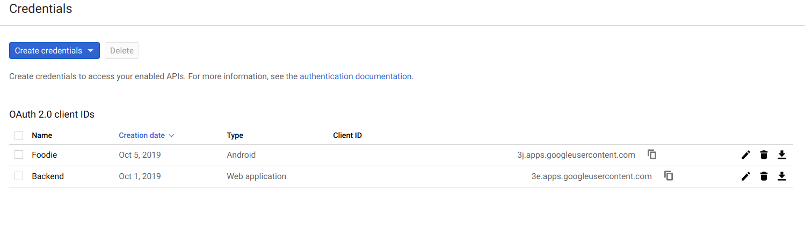
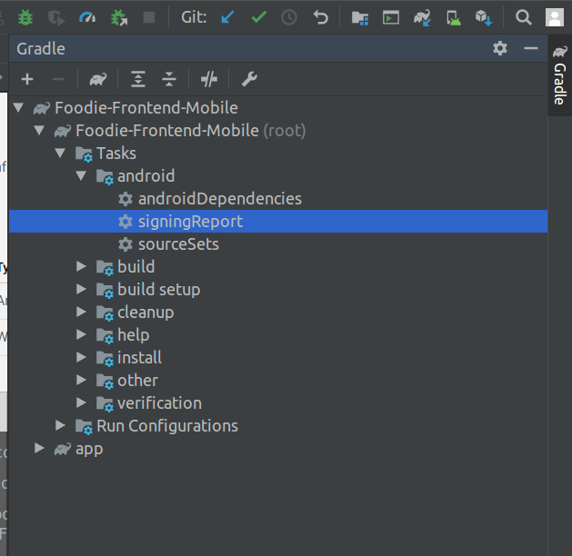

# Foodie-Frontend-Mobile
Android Mobile Application

## Docs
[Tutorial android](https://developer.android.com/training/basics/firstapp)  
[Testing](http://robolectric.org/getting-started/)

## Setup
- Clone this repo
- Open with android studio
- Sync gradle files
- Build apk

## Configuración del ambiente

Para poder utilizar OAuth2 con google necesitan dar de alta dos proyectos en [Google](https://console.developers.google.com/apis/credentials)

Tiene que crear una para android y otra para el server como está acá:

La aplicación android va a quedar configurada con el SHA-1 que nos da gradle y con el package name que está en el manifest.
Para sacar el SHA-1 pueden ir acá:

La aplicación de backend va a quedar configurada para pedir los datos básicos.

Para nuestro caso en la aplicación vamos a importar el client id del *backend* (no de android app) y lo vamos a colocar en: Foodie-Frontend-Mobile/app/src/main/res/values/config.xml bajo el nodo server_client_id.
